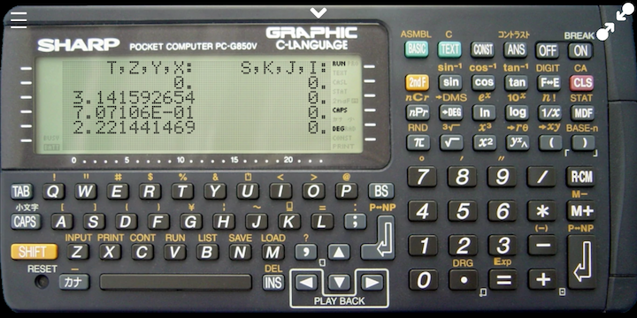

# RPN

A collection of powerful RPN calculator programs for the SHARP PC-G850(V)(S)
and PC-1475.

The RPN programs are written in BASIC.  The programs can be easily extended to
add custom operations and user-defined functions.

Familiarity with RPN calculators, in particular the
[HP-15C](http://www.hp.com/ctg/Manual/c03030589.pdf), is recommended.

## Features

- complex arithmetic with separate stack registers for real and imaginary parts
- 10 memory registers R0 to R9
- one and two variable statistical functions
- regression
- hyperbolic and trigonometric functions for complex values
- coordinate conversions to polar and rectangular
- combinatorial functions nPr, nCr and !
- gamma function
- GCD and LCM
- rational approximation of a decimal

## How to use

- SHARP [PC-G850(V)(S)](PC-G850/readme.md)

- SHARP [PC-1475](PC-1475/readme.md)

## How to load

Use the excellent [PocketTools](https://www.peil-partner.de/ifhe.de/sharp/)
to convert BASIC source code to wav files:

    bas2img --pc=G850 --level=8 rpn.bas
    bin2wav --pc=G850 rpn.img

Then `BLOAD` or `CLOAD` on your pocket computer.

Author: Dr. Robert A. van Engelen

